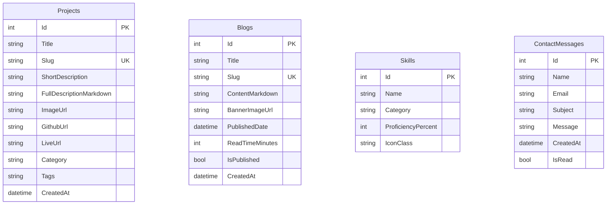

# System Design Document (SDD) — Minimalist Full-Stack Developer Portfolio

## 1. Architectural Architecture (MVC Pattern)
The application is structured using **ASP.NET Core MVC** (Model-View-Controller) with **Entity Framework Core (EF Core)** for data persistence, adhering to clean architecture principles.

```text
               ┌────────────────────────────────────────────────────────┐
               │                  Presentation Layer                    │
               │  [Razor Views (.cshtml)] ◄─► [Bootstrap 5 + CSS Custom] │
               └──────────────────────────┬─────────────────────────────┘
                                          │
                                          ▼  HTTP Requests / Views
               ┌────────────────────────────────────────────────────────┐
               │                    Controller Layer                    │
               │  [HomeController] [ProjectsController] [BlogsController]│
               │                  [AdminController]                     │
               └──────────────────────────┬─────────────────────────────┘
                                          │
                                          ▼  Service Calls / Repos
               ┌────────────────────────────────────────────────────────┐
               │                Business & Data Access Layer            │
               │  [IPortfolioRepository] ◄──► [ApplicationDbContext]     │
               └──────────────────────────────────┬─────────────────────┘
                                                  │
                                                  ▼  ORM Queries
               ┌────────────────────────────────────────────────────────┐
               │                    Database Layer                      │
               │                     [SQL Server]                       │
               └────────────────────────────────────────────────────────┘
```

*   **Models**: Simple POCO classes representing data tables and input validations (ViewModels).
*   **Views**: Razor Views built with semantic HTML5 elements and styled using Bootstrap 5 layered with modern custom variables.
*   **Controllers**: Light controllers parsing requests, invoking repositories/services, mapping domain models to view models, and returning responses.
*   **Data Layer**: `ApplicationDbContext` managing mapping configurations and EF Core database migration commands.

---

## 2. Database Schema (SQL Server Relational Model)



### Table Definitions

1.  **`Projects` Table**:
    *   `Id` (INT, Primary Key, Identity)
    *   `Title` (NVARCHAR(150), Required)
    *   `Slug` (NVARCHAR(150), Unique Index, Required) - *Used for semantic URL matching (e.g. `/projects/my-app`)*
    *   `ShortDescription` (NVARCHAR(300), Required)
    *   `FullDescriptionMarkdown` (NVARCHAR(MAX), Required) - *Rich detail with markdown elements*
    *   `ImageUrl` (NVARCHAR(500), Nullable)
    *   `GithubUrl` (NVARCHAR(500), Nullable)
    *   `LiveUrl` (NVARCHAR(500), Nullable)
    *   `Category` (NVARCHAR(50), Required) - *e.g., Full-Stack, Backend, Devops*
    *   `Tags` (NVARCHAR(200), Required) - *Comma-separated values for direct styling tags, e.g., "C#,ASP.NET,Docker"*
    *   `CreatedAt` (DATETIME, Default: GETDATE())

2.  **`Blogs` Table**:
    *   `Id` (INT, Primary Key, Identity)
    *   `Title` (NVARCHAR(200), Required)
    *   `Slug` (NVARCHAR(200), Unique Index, Required)
    *   `ContentMarkdown` (NVARCHAR(MAX), Required)
    *   `BannerImageUrl` (NVARCHAR(500), Nullable)
    *   `PublishedDate` (DATETIME, Required)
    *   `ReadTimeMinutes` (INT, Required)
    *   `IsPublished` (BIT, Required, Default: 0)
    *   `CreatedAt` (DATETIME, Default: GETDATE())

3.  **`Skills` Table**:
    *   `Id` (INT, Primary Key, Identity)
    *   `Name` (NVARCHAR(50), Required)
    *   `Category` (NVARCHAR(50), Required) - *e.g., "Languages", "Frameworks"*
    *   `ProficiencyPercent` (INT, Required, Range 1-100)
    *   `IconClass` (NVARCHAR(50), Nullable) - *e.g., "bi bi-braces", "devicon-csharp-plain"*

4.  **`ContactMessages` Table**:
    *   `Id` (INT, Primary Key, Identity)
    *   `Name` (NVARCHAR(100), Required)
    *   `Email` (NVARCHAR(100), Required)
    *   `Subject` (NVARCHAR(150), Required)
    *   `Message` (NVARCHAR(MAX), Required)
    *   `CreatedAt` (DATETIME, Default: GETDATE())
    *   `IsRead` (BIT, Default: 0)

---

## 3. API & Routing Architecture
The routing focuses on high readability and SEO optimizations using lowercase, hyphenated URL slugs.

| Route Target | Controller & Action | Method | Description |
| :--- | :--- | :--- | :--- |
| `/` | `HomeController.Index()` | GET | Portfolio Home (Hero, Timeline, Skills, Leadership, Contact) |
| `/projects` | `ProjectsController.Index()` | GET | Showcase listing with filter states |
| `/projects/{slug}` | `ProjectsController.Details(slug)`| GET | Render single project detail from Markdown |
| `/blogs` | `BlogsController.Index()` | GET | Blog list overview |
| `/blogs/{slug}` | `BlogsController.Details(slug)` | GET | Render rich text of a blog |
| `/contact` | `HomeController.SubmitContact()` | POST | Capture visitor message in database |
| `/admin` | `AdminController.Dashboard()` | GET | CMS listing panel (Authenticated) |
| `/admin/login` | `AdminController.Login()` | GET/POST | Simple secure administrative lock |
| `/admin/projects/create`| `AdminController.CreateProject()` | POST | Save project dynamic data |

---

## 4. Deployment Strategy (Vercel Core & SQL Database)

### 4.1 Deploying ASP.NET Core on Vercel
Deploying `.NET` backend apps on Vercel is done using a serverless builder runtime or a containerized integration proxy:

1.  **Vercel Serverless Function Bridge**:
    *   Configure Vercel using `vercel.json` and the community `vercel-dotnet` builder runtime to compile and invoke the ASP.NET Core Web App as serverless functions.
    ```json
    {
      "version": 2,
      "builds": [
        {
          "src": "*.csproj",
          "use": "vercel-dotnet@latest"
        }
      ],
      "routes": [
        { "src": "/(.*)", "dest": "/" }
      ]
    }
    ```
2.  **Dual Hosting Pipeline (Recommended Industry Practice)**:
    *   **Frontend**: Build and compile Bootstrap templates/Razor styles statically or via a lightweight static static-web-generator and host it on Vercel.
    *   **Backend MVC & SQL**: Host the fully functional ASP.NET Core application on **Render**, **Railway**, or **Azure App Service** inside a Docker container (fully free or low tier), and connect to **Azure SQL Server** or **Neon PostgreSQL/SQL Server cloud**. 
    *   This ensures 100% stability of ASP.NET Core MVC's session states and background routing.

### 4.2 Database Hosting
*   Use a managed cloud SQL Server database instance (e.g., **Azure SQL Database** (Free Tier), **SmarterASP.NET SQL**, or **ElephantSQL/Supabase Postgres** as database mapping equivalent with EF Core).
*   Connection strings are stored securely in environment variables (`ConnectionStrings__DefaultConnection`) and never hardcoded in the repository source code.
